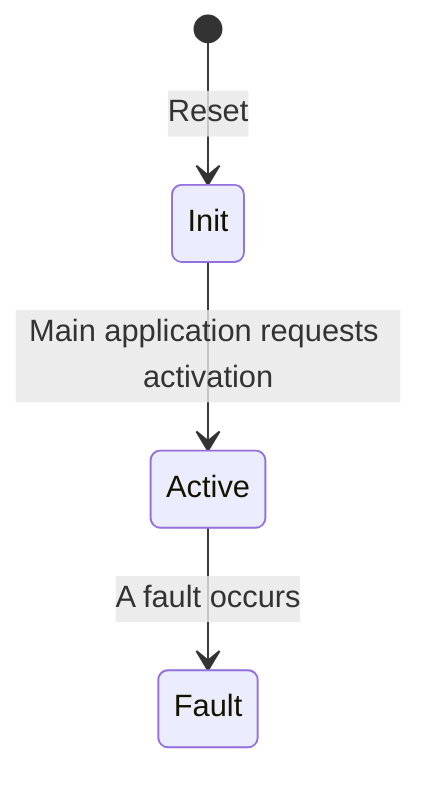

The firmware of the VCM monitor microcontroller is intentionally very simple for two reasons:
- Less code -> less bugs
- Les functionality -> not as much updates needed.

The application will monitor a few different things:
- State of the application in the main microcontroller through a serial bus
- Accelerator pedal inputs
- Brake pedal input
- Torque request send from the application in the main microcontroller to the inverter over [EV-CAN](/posts/nissan_leaf_ev-can)
- Motor rotational speed reported by the inverter.

It's only task is to control the high side output of the VCM and to disable it in case of any faults. This output feed the high voltage contactors through a series of interlock circuits and the emergency stop button while the main application controlls the low side, open drain, outputs to the high voltage contactors. This give the main application full control of the contactors as long as the monitor has not detected any faults.

The firmware is written in Rust and can be found in the vehicle controller monorepo at [GitHub](https://github.com/aphid-ev/vehicle-controller/tree/main/firmware/monitor-app)

## States
The firmware only have three states:

### Init
`High side output: off`

After reset the firmware starts in the `Init` state. All peripherals and the application is initialized and then awaits activation request from the application in the main microcontroller.

### Active
`High side output: on`

After the activation request has been received the high side driver is activated and all safety related signals is monitored. Unless any fault happesn, the application will stay in this state indefinetely.

### Fault
`High side output: off`

If a fault would occur, the application enters the fault state and the high side driver is deactivated. The monitor application will remain in this state until the microcontroller is reset.

## Faults
The following conditions will take the application from the active state to the fault state.

### Main application unresponsive
If the main application fail to respond within **100 ms** on a status request on the serial communication this fault will be triggered.

### Faulty accelerator signal
If the dual channel accelerator pedal input isn't within **10%** of eachother, this fault will be triggered.

### Faulty accelerator supply
The VCM supply 5 V to the accelerator hall effect sensors. If this is outside of **±10%** a fault should be raised.

### Faulty torque request
If torque is outside of **10%** fo the accelerator pedal input for more than **200 ms** or if an accelerating torque is requested while **braking**.

### Faulty direction change
The the direction is changed from forward to reverse or vice versa while motor speed is above **TBD** rpm.
