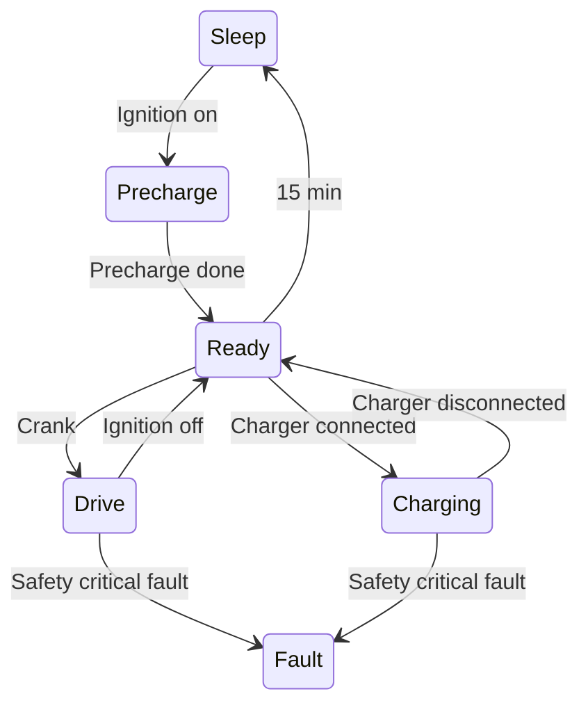

This post will try to collect the main requirements on the [DIY VCM](/tags/vcm). Even though it likely never will be formally tested, it is a good thing to get a grasp of what is needed before finalizing the design. This is also great to document for future reference.

# Environmental
The VCM will be mounted inside the drivers compartment, though it still needs to be fairly rugged. Since the car will be driven in Sweden, low temperatures is more likely than really high, though it may become a nice-weather-car.

## Ingress protection
The VCM shall have **IP67** ingress protection

## Temperature
The VCM shall be designed for an operating temperature of **-40 to +60 °C**.

## Shock and vibration
*TBD*

## Condensation
The enclosure shall be fitted with a GoreTex breather membrane to prevent internal condensation

# Electrical
These are the electrical requirements on the VCM

## Supply voltage
Th VCM shall be designed for a nominal voltage of **12 VDC** but be fully operational between **8 to 18 VDC**

## Supplies
The VCM shall have 3 different supply rails with the following current consumption.

### Constant
- Operational: **100 mA**
- Sleep: **0.1 mA**

### Ignition
- Operational: **10 A**
- Sleep: *disconnected*

### Crank
- Momentarily: **< 10 mA** (Just digital input)

## High side driver
The high side driver shall be able to supply **3 A** continously, and **10 A** during inrush events

The high side driver shall be suppplied from the ignition input.

## Low side drivers
The low side drivers shall be able to sink **1 A** continously, and **5 A** during inrush events. 

The low side drivers shall be grounded to two separate pins on the connectors.

# Mechanical
Most mechanical properties is set by the ModICE enclosure.

## Enclosure
The VCM shall use the Cinch ModICE ME-MX enclosure with breather vent.

Part nbr: **581-01-30-075**

## Connectors
The VCM shall use The Cinch ModICE header with two 12-pin Molex MX150 connectors

Part nbr: **581-01-24-011**

The matching wire harness connectors are
- Keying A (black): Molex MX120 **33472-1201**
- Keying B (light gray): Molex MX120 **33472-1202**

With the pin terminals:
- 14-16 AWG (1.5-2.5 mm2): **33012-2001**
- 18-20 AWG (0.5-0.75 mm2): **33012-2002**
- 22 AWG (0.34 mm2): **33012-2003**

## Mounting
The VCM shall be mounted using **2 x M6** screws with washers. The discance between the mounting holes is **101.6 mm** *(4")*

# I/O
The connectors have the following pinout

_VCM pinout_

Pin | Keying A (black) | Keying B (light gray)
--- | --- | ---
1 | GND | LSD GND
2 | CAN1 Low | CAN2 Low
3 | CAN1 High | CAN2 High
4 | *TBD* | *TBD*
5 | Charger connected | *TBD*
6 | *TBD* | Ignition
7 | Accelerator GND | LSD GND
8 | Accelerator IN1 | Lower contactor
9 | Accelerator IN2 | Upper contactor
10 | Accelerator +5V | Precharge
11 | Brake IN | High side drive
12 | B+ | Ignition

## CAN
There are two CAN busses available on the device designed for 500 kbit/s ISO 11898-1 communication.

### CAN 1 - EV-CAN
This is the main CAN-bus and the only one that is monitored by the safety monitor. This should be used for all safety related funtionality e.g. torque request. More info on the [EV-CAN](/posts/nissan_leaf_ev-can) post.

### CAN 2 - Auxillary
*TBD*, maybe to the instrument cluster and lighting control?

## High side driver
The high side driver is controlled by the [VCM monitor application](/posts/vcm_monitor_firmware), it is sourced by the [ignition](#ignition) supply and will be enabled as long as no critical fault has been detected. This should drive the high side of both the main and pre-charge contactors.

## Low side drivers
The low side drivers are controlled by the [VCM main application](/posts/vcm_main_firmware) alowing each contactor to be controlled individually as long as the high side driver is enabled.

### Pre-charge
The pre-charge output is used to control a smaller contactor in series with a high power resistor that can charge the inverter capacitor bank before closing the main contactor.

### Top contactor
The top contactor output is used to control the main contactor on the positive terminal of the battery.

### Bottom contactor
The top contactor output is used to control the main contactor on the negative terminal of the battery.

## Accelerator pedal
The VCM shall be able to interface a dual channel electrical accelerator pedal based on 5V Hall effect sensors.

### Accelerator +5V / GND
The VCM shall be able to support the accelerator pedal with **5 VDC** at a maximum of **0.5 A**.

### Accelerator Signal 1 & 2
The VCM shall have two independent **0 - 5 VDC** sensor inputs from the accelerator pedal that are monitored for safety.

## Brake
The VCM shall have a 12 VDC input from the brake pedal to prevent positive torque and request regenerative brakeing from the inverter.

## Charger connected
The VCM shall have a 12 VDC input from the charging inlet notifying the VCM if a charging cable is connected.

# Functional
These are the high level functional requirements, see posts on [VCM main application](/posts/vcm_main_firmware) and [VCM monitor application](/posts/vcm_monitor_firmware) for more detailed functional requirements.

## Safety
The VCM shall have a separate monitoring CPU controlling the high side driver. This will enable releasing the main contactor in case of a serious fault condition. See the posts on overall [Safety Architecture](/posts/safety_architecture) and the [VCM monitor application](/posts/vcm_monitor_firmware) for more details.

## Functional States
The VCM has the following functional states:

### Sleep
During sleep the main DC/DC power supply inside the VCM is switched off all all electronic circuitry is unpowered, the only way to wake the VCM from sleep is to supply 12V power to the [ignition](#ignition) pin.

High side | disabled
Precharge | disabled
Main contactors | disabled
Torque: | not allowed

### Precharge
During the precharge state, the precharge contactor is activated to slowly (within seconds) charge the inverter capacitor bank through a power resistor. Once the inverter capacitor voltage has reached **90%** of the full battery voltage the VCM moves into the ready state.

High side | enabled
Precharge | enabled
Main contactors | disabled
Torque: | not allowed (N)

### Ready
Once Precharge is done and the main contactors are closed, ready state is entered. It can also be entered by turning of the ignition while in drive state. After **15 min** of idling, the VCM will enter **sleep**

High side | enabled
Precharge | disabled
Main contactors | enabled
Torque: | not allowed (N)

### Drive
If the key is turned to the **crank** position while in Ready mode, VCM moves into drive mode and starts to monitor accelerator pedals and providing corresponding torque request to inverter.

High side | enabled
Precharge | disabled
Main contactors | enabled
Torque: | allowed (F or R)

### Charging
If the charging cable is connected in **Ready** mode the VCM shall move into charging mode preventing the car to drive and allowing the PDM to charge HV battery if the cable is connected to 240 VAC.

High side | enabled
Precharge | disabled
Main contactors | enabled
Torque: | not allowed (N)

## Reset
If there is a fault active that disabled the high side driver, the **crank** signal shall reset both the [VCM main application](/posts/vcm_main_firmware) and the [VCM monitor application](/posts/vcm_monitor_firmware).