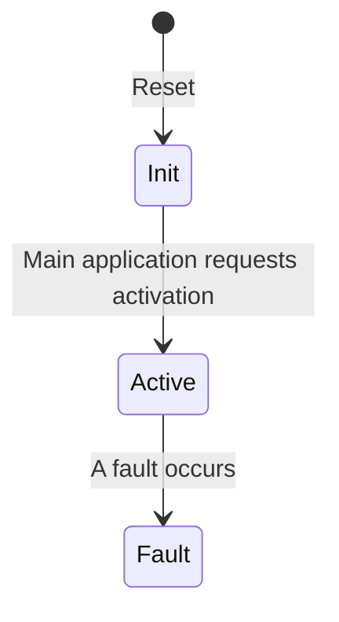

The firmware of the [[vcm]] monitor microcontroller is
intentionally very simple for two reasons:

- Less code → fewer bugs.
- Less functionality → fewer updates needed.

The application monitors a few different things:

- State of the application in the main microcontroller, through a serial
  bus.
- Accelerator pedal inputs.
- Brake pedal input.
- Torque request sent from the application in the main microcontroller to
  the inverter over [[EV-CAN]].
- Motor rotational speed reported by the inverter.

Its only task is to control the high side output of the VCM and disable
it in case of any faults. This output feeds the high voltage contactors
through a series of interlock circuits and the emergency stop button,
while the main application controls the low side (open-drain) outputs to
the same contactors. This gives the main application full control of the
contactors *as long as* the monitor has not detected any faults.

The firmware is written in Rust and can be found in the vehicle
controller monorepo at
[GitHub](https://github.com/aphid-ev/vehicle-controller/tree/main/firmware/monitor-app).

# States

The firmware has only three states:

## Init

`High side output: off`

After reset, the firmware starts in the `Init` state. All peripherals and
the application are initialized, and then it awaits an activation request
from the main microcontroller.

## Active

`High side output: on`

After the activation request has been received, the high side driver is
activated and all safety-related signals are monitored. Unless a fault
happens, the application stays in this state indefinitely.

## Fault

`High side output: off`

If a fault occurs, the application enters the fault state and the high
side driver is deactivated. The monitor application remains in this state
until the microcontroller is reset.

# Faults

The following conditions take the application from the active state to
the fault state.

## Main application unresponsive

If the main application fails to respond within **100 ms** to a status
request on the serial communication, this fault is triggered.

## Faulty accelerator signal

If the dual-channel accelerator pedal inputs are not within **10 %** of
each other, this fault is triggered.

## Faulty accelerator supply

The VCM supplies 5 V to the accelerator hall-effect sensors. If this is
outside of **±10 %**, a fault is raised.

## Faulty torque request

If torque is outside of **10 %** of the accelerator pedal input for more
than **200 ms**, or if accelerating torque is requested while **braking**.

## Faulty direction change

If the direction is changed from forward to reverse or vice versa while
motor speed is above *TBD* rpm.
