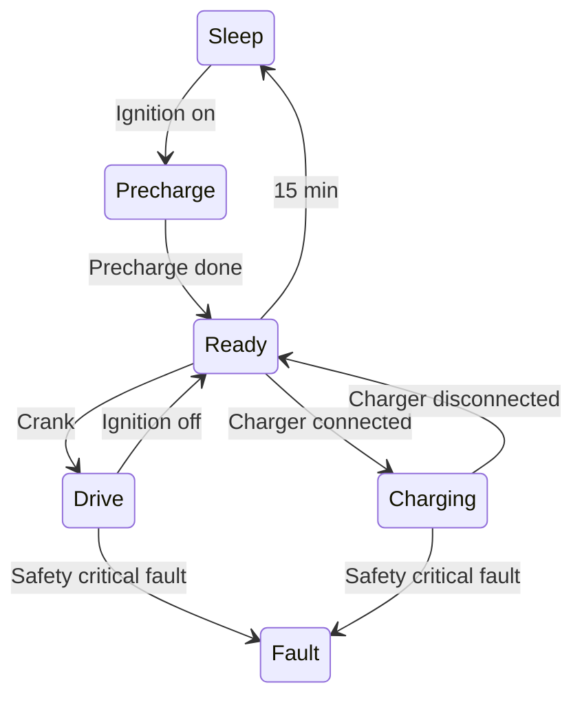

This page collects the main requirements for the DIY VCM. Even though it
will likely never be formally tested, it is a useful thing to have a grasp
of before finalizing the design — and good documentation for future
reference. The overall reasoning behind the safety choices is in the
[[safety]] post.

# Environmental

The VCM will be mounted inside the driver compartment, but it still needs
to be fairly rugged. Since the car will be driven in Sweden, low
temperatures are more likely than really high ones — though it may end up
a nice-weather-car.

## Ingress protection

The VCM shall have **IP67** ingress protection.

## Temperature

The VCM shall be designed for an operating temperature of **−40 to +60 °C**.

## Condensation

The enclosure shall be fitted with a GoreTex breather membrane to prevent
internal condensation.

# Electrical

## Supply voltage

The VCM shall be designed for a nominal voltage of **12 VDC** but be fully
operational between **8 to 18 VDC**.

## Supplies

The VCM shall have three different supply rails with the following current
consumption.

### Constant

- Operational: **100 mA**
- Sleep: **0.1 mA**

### Ignition

- Operational: **10 A**
- Sleep: *disconnected*

### Crank

- Momentarily: **< 10 mA** (digital input only)

## High side driver

The high side driver shall be able to supply **3 A** continuously, and
**10 A** during inrush events. It shall be supplied from the ignition
input.

## Low side drivers

The low side drivers shall be able to sink **1 A** continuously, and
**5 A** during inrush events. They shall be grounded to two separate pins
on the connectors.

# Mechanical

Most mechanical properties are set by the ModICE enclosure.

## Enclosure

The VCM shall use the Cinch ModICE ME-MX enclosure with breather vent.

Part number: **581-01-30-075**

## Connectors

The VCM shall use the Cinch ModICE header with two 12-pin Molex MX150
connectors.

Part number: **581-01-24-011**

Matching wire harness connectors:

- Keying A (black): Molex MX120 **33472-1201**
- Keying B (light gray): Molex MX120 **33472-1202**

Pin terminals:

- 14–16 AWG (1.5–2.5 mm²): **33012-2001**
- 18–20 AWG (0.5–0.75 mm²): **33012-2002**
- 22 AWG (0.34 mm²): **33012-2003**

## Mounting

The VCM shall be mounted using **2 × M6** screws with washers. The
distance between the mounting holes is **101.6 mm** (4″).

# I/O

The connectors have the following pinout:

*VCM pinout.*

| Pin | Keying A (black) | Keying B (light gray) |
| --- | --- | --- |
| 1 | GND | LSD GND |
| 2 | CAN1 Low | CAN2 Low |
| 3 | CAN1 High | CAN2 High |
| 4 | *TBD* | Waterpump PWM Out |
| 5 | Charger connected | Waterpump PWM In |
| 6 | *TBD* | Ignition |
| 7 | Accelerator GND | LSD GND |
| 8 | Accelerator IN1 | Lower contactor |
| 9 | Accelerator IN2 | Upper contactor |
| 10 | Accelerator +5V | Precharge |
| 11 | Brake IN | High side drive |
| 12 | B+ | Ignition |

# Functional states

The VCM has the following functional states:

## Sleep

The main DC/DC inside the VCM is switched off and all electronic circuitry
is unpowered. The only way to wake the VCM from sleep is to supply 12 V
to the ignition pin.

| High side | disabled |
| Precharge | disabled |
| Main contactors | disabled |
| Torque | not allowed |

## Precharge

The precharge contactor is activated to slowly (within seconds) charge the
inverter capacitor bank through a power resistor. Once the inverter
capacitor voltage has reached **90 %** of the full battery voltage, the
VCM moves into the ready state.

| High side | enabled |
| Precharge | enabled |
| Main contactors | disabled |
| Torque | not allowed (N) |

## Ready

Precharge is done and the main contactors are closed. Can also be entered
by turning off the ignition while in drive. After **15 min** of idling,
the VCM enters **sleep**.

| High side | enabled |
| Precharge | disabled |
| Main contactors | enabled |
| Torque | not allowed (N) |

## Drive

If the key is turned to the **crank** position while in ready, the VCM
moves into drive mode and starts monitoring the accelerator pedals,
providing a corresponding torque request to the inverter.

| High side | enabled |
| Precharge | disabled |
| Main contactors | enabled |
| Torque | allowed (F or R) |

## Charging

If the charging cable is connected in **ready** mode, the VCM moves into
charging mode — preventing the car from driving and allowing the PDM to
charge the HV battery if the cable is connected to 240 VAC.

| High side | enabled |
| Precharge | disabled |
| Main contactors | enabled |
| Torque | not allowed (N) |
